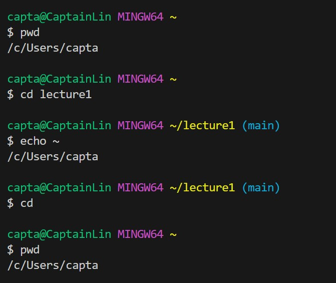
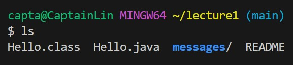

**Lab Report 1** 

**Examples of `cd`**

An example of using the command with no arguments

The absolute path to the working directory before the command was run: `/c/Users/capta/lecture1`
When `cd` is used without arguments, the current working directory is changed to the home directory. which, in my case, it went to `/c/Users/capta`, which is my home directory
Having no arguments means entering the `cd` command without additional information. This performs the default operation of changing the directory to the user's home directory. 
There is no error in this case since if `cd` is not provided with any arguments, the working directory will be changed to the user's home directory. 

An example of using the command with a path to a directory as an argument.

The absolute path to the working directory was right before the command was run: `/c/Users/capta`
When we use the command `cd` with a path to lecture1 as an argument, it changes the current working directory to `/c/Users/capta/lecture1`. The output of this command is that I am in `/c/Users/capta/lecture1`, which is also a working directory.  `cd` changes the working directory to the path that is specified which was `lecture1`. Since lecture1 is a working directory and the path `/c/Users/capta/lecture1` exists, it changes it to `/c/Users/capta/lecture1`. 
The directory exists, so I didn't get an error. However, if the directory doesn't exist or the path is incorrect, I will get an error and cannot change the working directory.  

An example of using the command with a path to a file as an argument.

The absolute path to the working directory was right before the command was run: `/c/Users/capta/lecture1`
When we use the command `cd` with a path to a file as an argument, in this case Hello.java, we get an error that says `bash: cd: Hello.java is not a directory.` 
This means that `cd` cannot be used with a path to a file as its argument; you can use the directory part of the file's path to change the working directory to where the file is located. The working directory is still `/c/Users/capta/lecture1`. The  `cd` command requires a directory as an argument, not a file. If you want to navigate to a file, you need to change it to the directory that contains that file but not the file itself. 

**Examples of `ls`**

An example of using the command with no arguments

The absolute path to the working directory was right before the command was run: `/c/Users/capta/lecture1`
When we use the command `ls` without any arguments, it displays the files and directories in the current working directory. When you use `ls` without any arguments, you are simply viewing the current location within the filesystem, which is the directory I am currently in (`/c/Users/capta/lecture1`). The output doesn't give an error as it just lists the contents of my current working directory, and since `/c/Users/capita/lecture1` is a working directory, it didn't cause an error. 

Share an example of using the command with a path to a directory as an argument.

 

